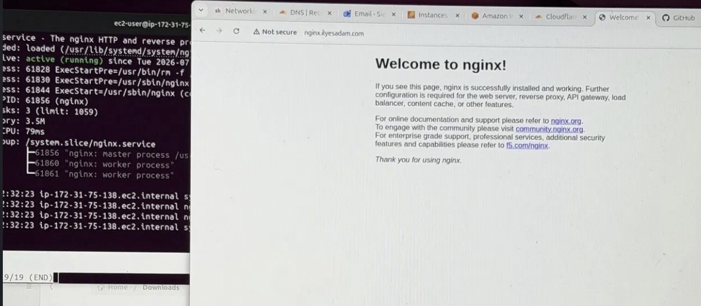

# AWS Nginx EC2 Deployment
## Overview
This project documents the deployment of an Nginx web server on an AWS EC2 instance, configured with a custom domain via Cloudflare DNS. The goal was to gain hands-on experience with cloud infrastructure, Linux server administration, and DNS configuration as part of my DevOps learning journey.

## Tech Stack
- **Cloud Provider:** AWS (EC2)
- **Operating System:** Amazon Linux 2
- **Web Server:** Nginx
- **DNS Management:** Cloudflare
- **Domain:** ilyesadam.com

## What I Did
1. Launched an EC2 instance (Amazon Linux 2)
2. Configured security groups to allow HTTP (port 80) and SSH (port 22) traffic
3. Connected to the instance via SSH using a generated key pair
4. Installed and started Nginx using the package manager
5. Verified the service was active using `systemctl status nginx`
6. Pointed a custom domain to the instance's public IP via Cloudflare DNS (A record)
7. Confirmed the deployment by accessing the domain in a browser and seeing the default Nginx welcome page

## Commands Used
```bash
sudo yum update -y
sudo yum install nginx -y
sudo systemctl start nginx
sudo systemctl enable nginx
sudo systemctl status nginx
```

## Result


The screenshot shows the terminal output confirming Nginx is active and running, alongside the browser successfully loading the site at `nginx.ilyesadam.com`.

## What I Learned
- How to launch and configure an EC2 instance from scratch
- Managing Linux services with `systemctl`
- Configuring security groups for inbound traffic rules
- Setting up DNS records to point a domain at a cloud server
- Basic troubleshooting of service status and connectivity

